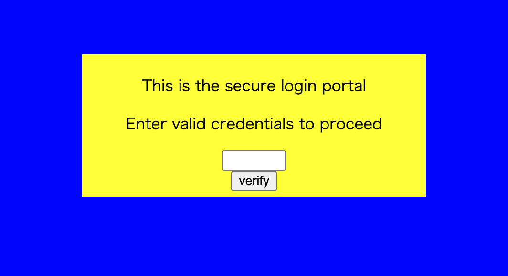

# dont-use-client-side

[https://jupiter.challenges.picoctf.org/problem/37821/](https://jupiter.challenges.picoctf.org/problem/37821/)



上記のような画面が出る

コードを見てみるとhtmlのコードの中に以下のようなものがあった

```html
<script type="text/javascript">
  function verify() {
    checkpass = document.getElementById("pass").value;
    split = 4;
    if (checkpass.substring(0, split) == 'pico') {
      if (checkpass.substring(split*6, split*7) == 'a3c8') {
        if (checkpass.substring(split, split*2) == 'CTF{') {
         if (checkpass.substring(split*4, split*5) == 'ts_p') {
          if (checkpass.substring(split*3, split*4) == 'lien') {
            if (checkpass.substring(split*5, split*6) == 'lz_1') {
              if (checkpass.substring(split*2, split*3) == 'no_c') {
                if (checkpass.substring(split*7, split*8) == '9}') {
                  alert("Password Verified")
                  }
                }
              }
      
            }
          }
        }
      }
    }
    else {
      alert("Incorrect password");
    }
    
  }
</script>
```

4文字ずつsplitとしてFlagが正しいかを確認しているコードである

これを0からsplit*8の部分までを繋げると、picoCTF{no_clients_plz_1a3c89}というFlagが出てくる

