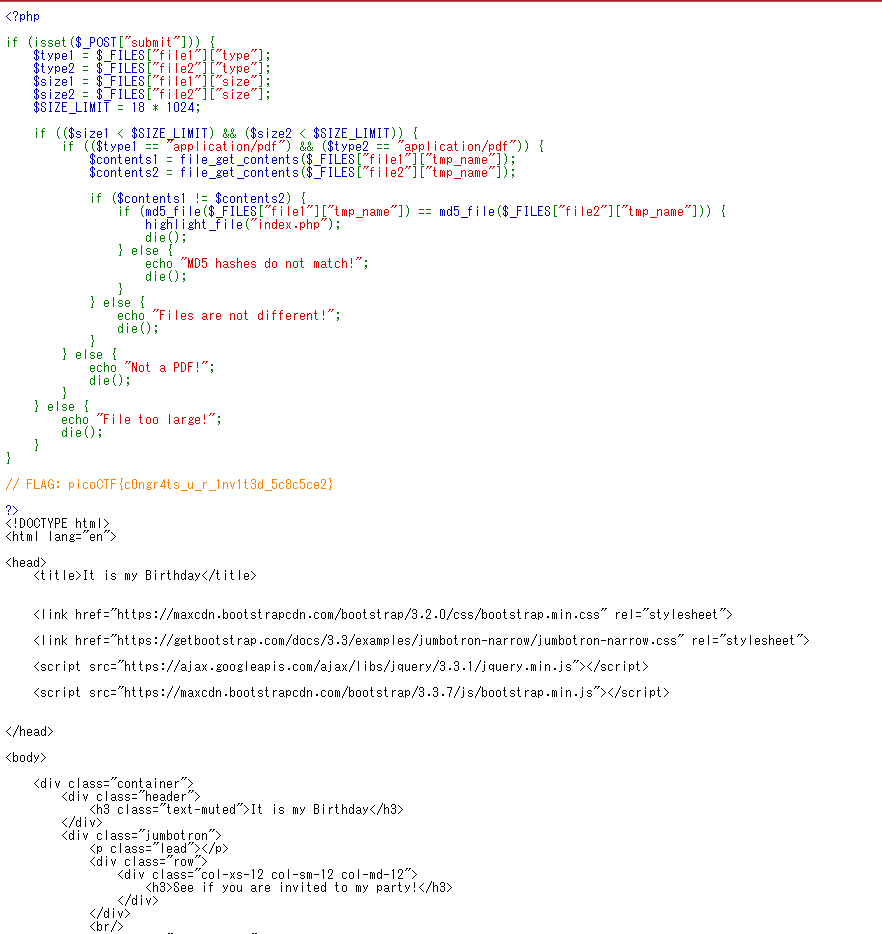

# It is my Birthday

[http://mercury.picoctf.net:63578/](http://mercury.picoctf.net:63578/)

上記の画面が表示される

二つの異なるファイルを選択し、Uploadすると

MD5のハッシュ値が異なると言われる

MD5には脆弱性があることがわかっている

異なるファイルで同じハッシュ値となるファイルが存在する

[https://github.com/corkami/collisions/tree/master/examples/free](https://github.com/corkami/collisions/tree/master/examples/free)

上記のそれぞれの拡張子のmd5-1とmd5-2は異なるファイルでハッシュ値が一緒のファイルである

それを使って解答する

上記が表示されて、flag発見!