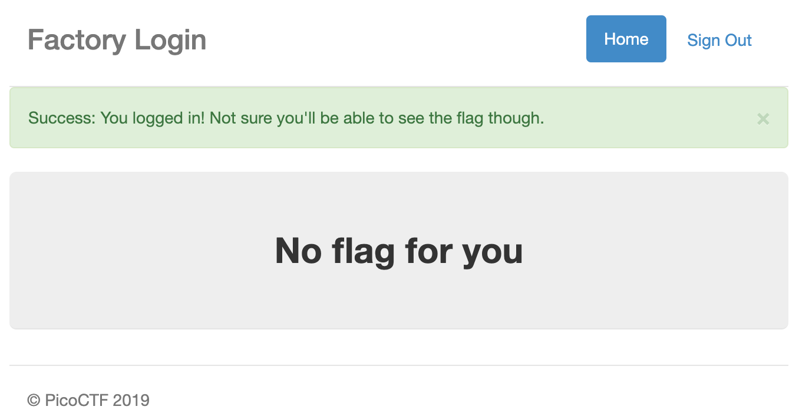

# logon

問題: [https://jupiter.challenges.picoctf.org/problem/13594/](https://jupiter.challenges.picoctf.org/problem/13594/)

上記の画像のようなログイン画面が出てくる

適当な値でサインインすると下の画面になる

Usernameにusername、Passwordにpasswordを入力した

サインイン時のリクエストをBurp SuiteのRepeaterを使って乗っ取る

リクエストには

Cookie: password=password; username=username; admin=False

が入っていた

adminをTrueにしてもう一度リクエストする

すると、以下の画像のようにFlagが出てきた

