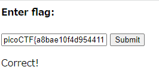

# Some Assembly Required 1

[http://mercury.picoctf.net:37669/index.html](http://mercury.picoctf.net:37669/index.html)

URLをアクセスすると上記画像の画面が表示される

ディベロッパーツールでソースの中身を確認

ファイルは

- index.html
- G82XCw5CX3.js
- wasm/adda0372

がある

wasmフォルダの中にflagがあった

それをEnter flagに入れると

このような画像が表示されてflagが正しいことがわかる

アセンブリ言語でいろいろしてあるっていうことはわかるが実際にどういう処理を行っているかはわからん

あとjsファイルも一行で書いてあり、変数名などが16進数になっているものがある

それをいろいろしてくれるサイト

[JS NICE: Statistical renaming, Type inference and Deobfuscation](http://jsnice.org/)

write up 

[https://github.com/Dvd848/CTFs/blob/master/2021_picoCTF/Some_Assembly_Required_1.md](https://github.com/Dvd848/CTFs/blob/master/2021_picoCTF/Some_Assembly_Required_1.md)