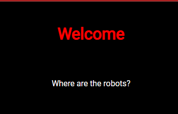
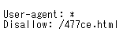
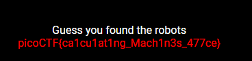

# where are the robots

[http://jupiter.challenges.picoctf.org:36474](http://jupiter.challenges.picoctf.org:36474/)

問題がWhere are the robotsということで

ロボット型検索エンジンとはなんですかとchatGPTに拝聴

以下解答

ロボット型検索エンジンは、インターネット上の情報を収集し、索引付けして検索結果を提供するためにロボットやクローラーと呼ばれるプログラムを使用する検索エンジンの一種です。

一般的な検索エンジンは、ウェブページの情報をクロールしてインデックス化し、ユーザーの検索クエリに基づいて関連するページを返します。一方、ロボット型検索エンジンは、より高度な自律型のロボットやAIを使用して、ウェブ上のさまざまなデータや情報を収集し、処理します。

ロボット型検索エンジンは、特定のデータベースや情報源を探索して特定の情報を抽出するために使用されることがあります。例えば、科学論文や特定の商品の価格比較、天気情報、株価など、特定の領域や分野の情報を収集するために利用されます。

ロボット型検索エンジンは、インターネット上の情報の迅速な収集と処理が必要な場合や、大量のデータを分析する必要がある場合に特に有用です。また、人間が手作業で行うのが困難なタスクを自動化するためにも利用されます。

具体的なロボット型検索エンジンとしては、Googleの「Google ボット」や、Microsoftの「Bingbot」などがあります。これらのエンジンは、ウェブ上の情報を収集してインデックス化し、利用者が検索クエリを入力すると関連する情報を提供します。

CTFでは何をするべきかというと

パスの最後にrobots.txtをつけて検索する

すると

という画面がでてきた

ので、`/477ce.html`に飛ぶと

Flag発見！！